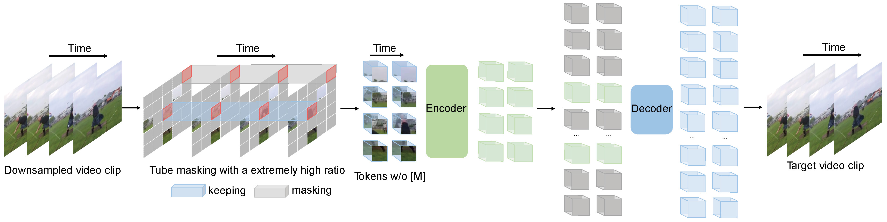

# Official PyTorch Implementation of VideoMAE (NeurIPS 2022 Spotlight).



[](https://creativecommons.org/licenses/by-nc/4.0/)<br>
[](https://huggingface.co/models?other=videomae)[](https://huggingface.co/spaces/sayakpaul/video-classification-ucf101-subset)[](https://colab.research.google.com/github/huggingface/notebooks/blob/main/examples/video_classification.ipynb)<br>
[](https://paperswithcode.com/sota/action-recognition-in-videos-on-something?p=videomae-masked-autoencoders-are-data-1)<br>
[](https://paperswithcode.com/sota/action-classification-on-kinetics-400?p=videomae-masked-autoencoders-are-data-1)<br>[](https://paperswithcode.com/sota/action-recognition-on-ava-v2-2?p=videomae-masked-autoencoders-are-data-1)<br>
[](https://paperswithcode.com/sota/self-supervised-action-recognition-on-ucf101?p=videomae-masked-autoencoders-are-data-1)<br>
[](https://paperswithcode.com/sota/self-supervised-action-recognition-on-hmdb51?p=videomae-masked-autoencoders-are-data-1)

> [**VideoMAE: Masked Autoencoders are Data-Efficient Learners for Self-Supervised Video Pre-Training**](https://arxiv.org/abs/2203.12602)<br>
> [Zhan Tong](https://github.com/yztongzhan), [Yibing Song](https://ybsong00.github.io/), [Jue Wang](https://juewang725.github.io/), [Limin Wang](http://wanglimin.github.io/)<br>Nanjing University, Tencent AI Lab

## 📰 News
**[2023.4.18]** 🎈Everyone can download **Kinetics-400**, which is used in VideoMAE, from [this link](https://opendatalab.com/Kinetics-400).<br>
**[2023.4.18]** Code and pre-trained models of [VideoMAE V2](https://arxiv.org/abs/2303.16727) have been released! Check and enjoy this [repo](https://github.com/OpenGVLab/VideoMAEv2)!<br>
**[2023.4.17]** We propose **[EVAD](https://arxiv.org/abs/2304.08451)**, an **end-to-end Video Action Detection** framework.<br>
**[2023.2.28]** Our [VideoMAE V2](https://arxiv.org/abs/2303.16727) is accepted by **CVPR 2023**! 🎉<br>
**[2023.1.16]** Code and pre-trained models for **Action Detection** in VideoMAE are [available](https://github.com/MCG-NJU/VideoMAE-Action-Detection)! <br>
**[2022.12.27]** 🎈Everyone can download extracted **VideoMAE** features of **THUMOS**, **ActivityNet**, **HACS** and **FineAction** from [InternVideo](https://github.com/OpenGVLab/InternVideo/tree/main/Downstream/Temporal-Action-Localization#to-reproduce-our-results-of-internvideo).<br>
**[2022.11.20]** 👀 VideoMAE is integrated into [](https://huggingface.co/spaces/sayakpaul/video-classification-ucf101-subset) and [](https://colab.research.google.com/github/huggingface/notebooks/blob/main/examples/video_classification.ipynb), supported by [@Sayak Paul](https://github.com/sayakpaul).<br>
**[2022.10.25]** 👀 VideoMAE is integrated into [MMAction2](https://github.com/open-mmlab/mmaction2/tree/dev-1.x/configs/recognition/videomae), the results  on Kinetics-400 can be reproduced successfully. <br>
**[2022.10.20]** The pre-trained models and scripts of **ViT-S** and **ViT-H** are available! <br>
**[2022.10.19]** The pre-trained models and scripts on **UCF101** are [available](MODEL_ZOO.md#UCF101)! <br>
**[2022.9.15]** VideoMAE is accepted by **NeurIPS 2022** as a **spotlight** presentation! 🎉 <br>
**[2022.8.8]** 👀 VideoMAE is integrated into **official** [🤗HuggingFace Transformers](https://huggingface.co/docs/transformers/main/en/model_doc/videomae) now! [](https://huggingface.co/models?other=videomae)<br>
**[2022.7.7]**  We have updated new results on downstream AVA 2.2 benchmark. Please refer to our [paper](https://arxiv.org/abs/2203.12602) for details. <br>
**[2022.4.24]**  Code and pre-trained models are available now! <br>
**[2022.3.24]** ~~Code and pre-trained models will be released here.~~ Welcome to **watch** this repository for the latest updates.

## ✨ Highlights

### 🔥 Masked Video Modeling for Video Pre-Training

VideoMAE performs the task of masked video modeling for video pre-training. We propose the **extremely high** masking ratio (90%-95%) and **tube masking** strategy to create a challenging task for self-supervised video pre-training.

### ⚡️ A Simple, Efficient and Strong Baseline in SSVP

VideoMAE uses the simple masked autoencoder and **plain ViT** backbone to perform video self-supervised learning. Due to the extremely high masking ratio, the pre-training time of VideoMAE is **much shorter** than contrastive learning methods (**3.2x** speedup). VideoMAE can serve as **a simple but strong baseline** for future research in self-supervised video pre-training.

### 😮 High performance, but NO extra data required

VideoMAE works well for video datasets of different scales and can achieve **87.4%** on Kinects-400, **75.4%** on Something-Something V2, **91.3%** on UCF101, and **62.6%** on HMDB51. To our best knowledge, VideoMAE is the **first** to achieve the state-of-the-art performance on these four popular benchmarks with the **vanilla ViT** backbones while **doesn't need** any extra data or pre-trained models.

## 🚀 Main Results

### ✨ Something-Something V2

|  Method  | Extra Data | Backbone | Resolution | #Frames x Clips x Crops | Top-1 | Top-5 |
| :------: | :--------: | :------: | :--------: | :---------------------: | :---: | :---: |
| VideoMAE |  ***no***  |  ViT-S   |  224x224   |         16x2x3          | 66.8  | 90.3  |
| VideoMAE |  ***no***  |  ViT-B   |  224x224   |         16x2x3          | 70.8  | 92.4  |
| VideoMAE |  ***no***  |  ViT-L   |  224x224   |         16x2x3          | 74.3  | 94.6  |
| VideoMAE |  ***no***  |  ViT-L   |  224x224   |         32x1x3          | 75.4  | 95.2  |

### ✨ Kinetics-400

|  Method  | Extra Data | Backbone | Resolution | #Frames x Clips x Crops | Top-1 | Top-5 |
| :------: | :--------: | :------: | :--------: | :---------------------: | :---: | :---: |
| VideoMAE |  ***no***  |  ViT-S   |  224x224   |         16x5x3          | 79.0  | 93.8  |
| VideoMAE |  ***no***  |  ViT-B   |  224x224   |         16x5x3          | 81.5  | 95.1  |
| VideoMAE |  ***no***  |  ViT-L   |  224x224   |         16x5x3          | 85.2  | 96.8  |
| VideoMAE |  ***no***  |  ViT-H   |  224x224   |         16x5x3          | 86.6  | 97.1  |
| VideoMAE |  ***no***  |  ViT-L   |  320x320   |         32x4x3          | 86.1  | 97.3  |
| VideoMAE |  ***no***  |  ViT-H   |  320x320   |         32x4x3          | 87.4  | 97.6  |

### ✨ AVA 2.2

Please check the code and checkpoints in [VideoMAE-Action-Detection](https://github.com/MCG-NJU/VideoMAE-Action-Detection).
|  Method  |  Extra Data  | Extra Label | Backbone | #Frame x Sample Rate | mAP  |
| :------: | :----------: | :---------: | :------: | :------------------: | :--: |
| VideoMAE | Kinetics-400 |   &cross;   |  ViT-S   |         16x4         | 22.5 |
| VideoMAE | Kinetics-400 |   &check;   |  ViT-S   |         16x4         | 28.4 |
| VideoMAE | Kinetics-400 |   &cross;   |  ViT-B   |         16x4         | 26.7 |
| VideoMAE | Kinetics-400 |   &check;   |  ViT-B   |         16x4         | 31.8 |
| VideoMAE | Kinetics-400 |   &cross;   |  ViT-L   |         16x4         | 34.3 |
| VideoMAE | Kinetics-400 |   &check;   |  ViT-L   |         16x4         | 37.0 |
| VideoMAE | Kinetics-400 |   &cross;   |  ViT-H   |         16x4         | 36.5 |
| VideoMAE | Kinetics-400 |   &check;   |  ViT-H   |         16x4         | 39.5 |
| VideoMAE | Kinetics-700 |   &cross;   |  ViT-L   |         16x4         | 36.1 |
| VideoMAE | Kinetics-700 |   &check;   |  ViT-L   |         16x4         | 39.3 |

### ✨ UCF101 & HMDB51

|  Method  |  Extra Data  | Backbone | UCF101 | HMDB51 |
| :------: | :----------: | :------: | :----: | :----: |
| VideoMAE |   ***no***   |  ViT-B   |  91.3  |  62.6  |
| VideoMAE | Kinetics-400 |  ViT-B   |  96.1  |  73.3  |

## 🔨 Installation

Please follow the instructions in [INSTALL.md](INSTALL.md).

## ➡️ Data Preparation

Please follow the instructions in [DATASET.md](DATASET.md) for data preparation.

## 🔄 Pre-training

The pre-training instruction is in [PRETRAIN.md](PRETRAIN.md).

## ⤴️ Fine-tuning with pre-trained models

The fine-tuning instruction is in [FINETUNE.md](FINETUNE.md).

## 📍Model Zoo

We provide pre-trained and fine-tuned models in [MODEL_ZOO.md](MODEL_ZOO.md).

## 👀 Visualization

We provide the script for visualization in [`vis.sh`](vis.sh).  Colab notebook for better visualization is coming soon.

## ☎️ Contact 

Zhan Tong: tongzhan@smail.nju.edu.cn

## 👍 Acknowledgements

Thanks to [Ziteng Gao](https://sebgao.github.io/), Lei Chen, [Chongjian Ge](https://chongjiange.github.io/), and [Zhiyu Zhao](https://github.com/JerryFlymi) for their kind support.<br>
This project is built upon [MAE-pytorch](https://github.com/pengzhiliang/MAE-pytorch) and [BEiT](https://github.com/microsoft/unilm/tree/master/beit). Thanks to the contributors of these great codebases.

## 🔒 License

The majority of this project is released under the CC-BY-NC 4.0 license as found in the [LICENSE](https://github.com/MCG-NJU/VideoMAE/blob/main/LICENSE) file. Portions of the project are available under separate license terms: [SlowFast](https://github.com/facebookresearch/SlowFast) and [pytorch-image-models](https://github.com/rwightman/pytorch-image-models) are licensed under the Apache 2.0 license. [BEiT](https://github.com/microsoft/unilm/tree/master/beit) is licensed under the MIT license.

## ✏️ Citation

If you think this project is helpful, please feel free to leave a star⭐️ and cite our paper:

```
@inproceedings{tong2022videomae,
  title={Video{MAE}: Masked Autoencoders are Data-Efficient Learners for Self-Supervised Video Pre-Training},
  author={Zhan Tong and Yibing Song and Jue Wang and Limin Wang},
  booktitle={Advances in Neural Information Processing Systems},
  year={2022}
}

@article{videomae,
  title={VideoMAE: Masked Autoencoders are Data-Efficient Learners for Self-Supervised Video Pre-Training},
  author={Tong, Zhan and Song, Yibing and Wang, Jue and Wang, Limin},
  journal={arXiv preprint arXiv:2203.12602},
  year={2022}
}
```
